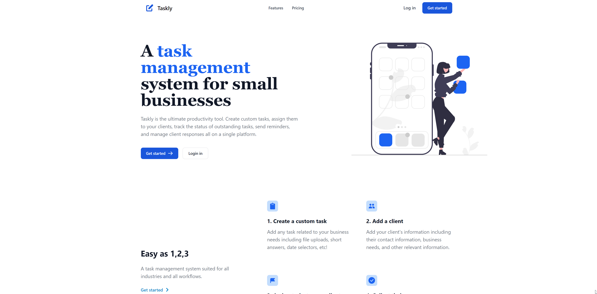
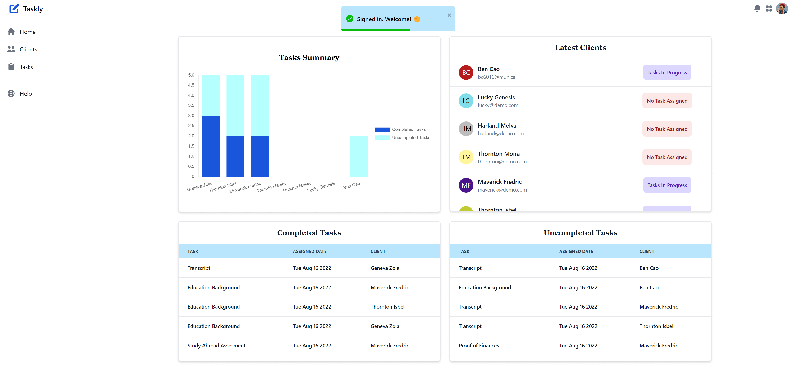
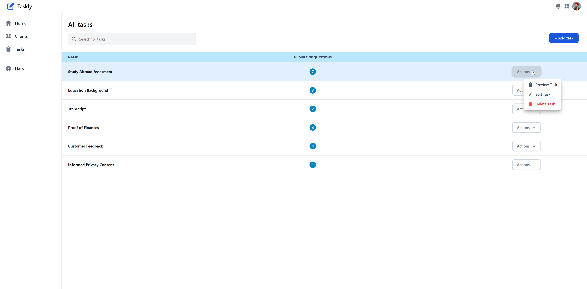
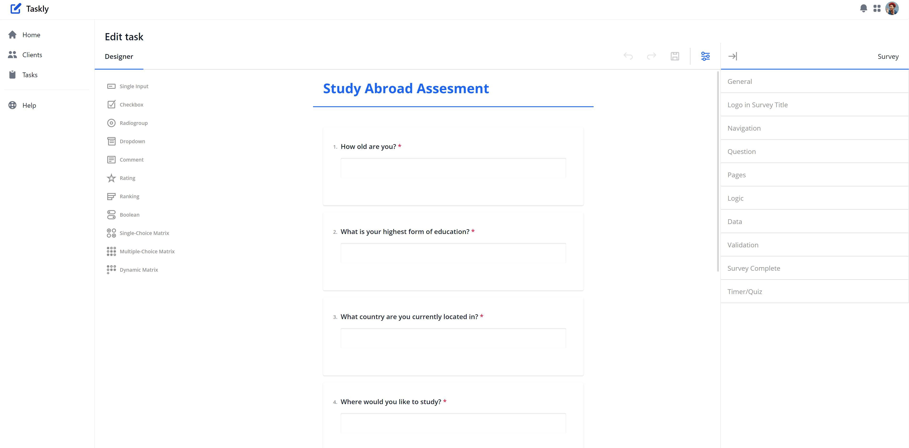
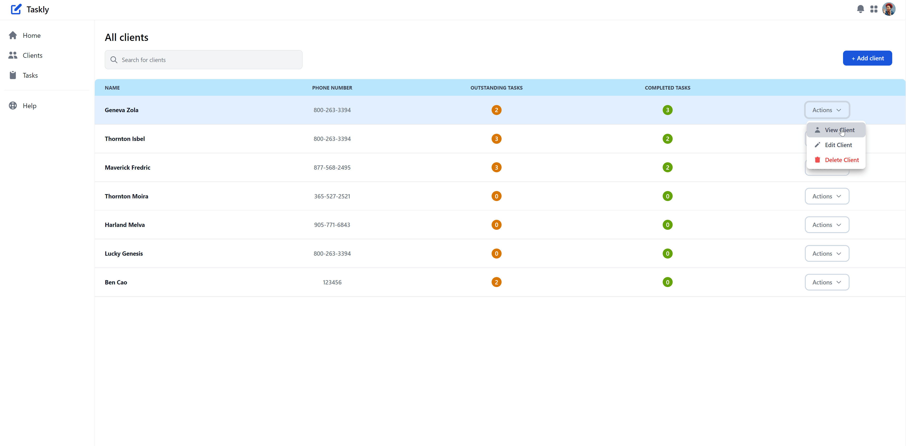
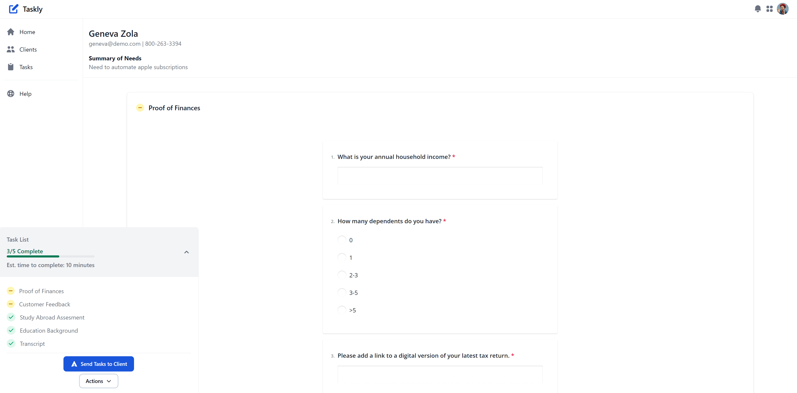
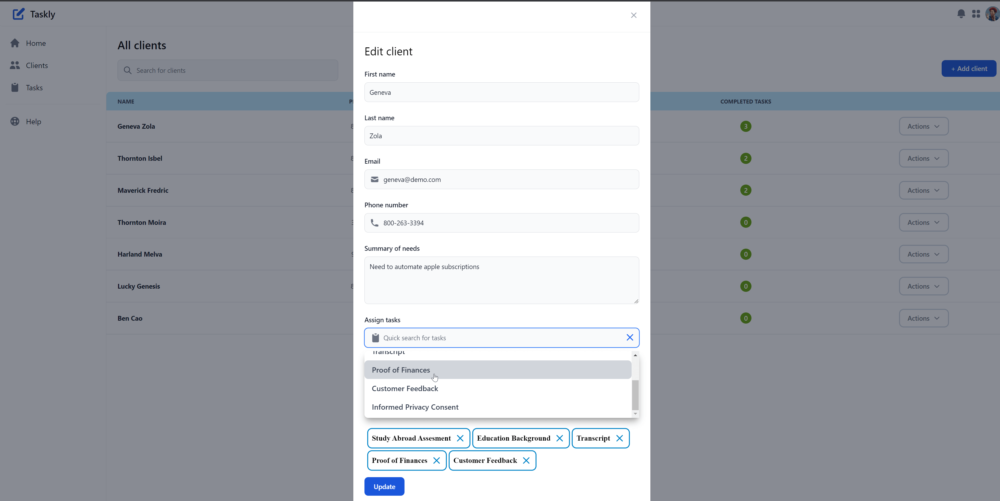
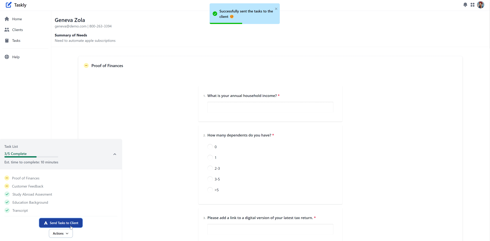

# README

## Introduction

Taskly is a task management system for small businesses.
Taskly is the ultimate productivity tool. Create custom tasks, assign them to your clients, track the status of outstanding tasks, send reminders, and manage client responses all on a single platform.

**_Click here to check the live demo site_** ➡️ https://joyful-axolotl-efcdda.netlify.app/

#### **_Use guest account for the demo:_**

- username: ben@demo.com
- password: password66

## Tech Stack

- Express.js
- PostgresSQL
- React
- Tailwind

## Dependencies

#### Backend:

- Nodejs
- express
- SequelizeORM
- bcrypt
- nodemailer

#### Frontend:

- react@18.2.0 or above
- react-router-dom
- react-chartjs-2
- axios
- tailwindcss
- formik
- headlessui
- Flowbite
- SurveyJS

## Setups

```
$ git clone git@github.com:BENcao318/Taskly.git taskly
$ cd server
$ npm install
$ cd ..
$ cd client
$ npm install
```

```
- You would need sequelize to create the database and adding seeds
- We recommand use sequelize cli to easily implement above process
- You might also need to change the username and password in server/config/config.json in order to connect to your database. We use postgreSQL for this application
$ cd server
$ npm install --save-dev sequelize-cli
$ sequelize db:create
$ sequelize db:migrate
$ sequelize db:seed:all
- Above commands will help setup the tables and add seeds in the database.
- To login as an admin and see the example data, you can use username: ben@demo.com, password: password66
```

```
- Start the server:
$ cd server
$ npm run devStart
- Start the client:
$ cd client
$ npm start
- Access the page on localhost:3000
```

## Screenshots

- Landing Page
  

- Home Page
  

- Tasks Page
  

- Tasks Editing Page
  

- Clients Page
  

- Client View Page
  

- Client Edit Page
  

- Send Tasks To Client Through Email
  
